# Auto Makhsus Visual Proof Report

Date: 2026-06-15

Scope: AutoMakhsus.com visual proof only. No code, routing, infrastructure, database, or deployment changes were made for this report.

## Method

Screenshots were captured from the deployed AutoMakhsus.com site through production Traefik Host routing on the application network. The screenshots prove the ShiftUp-inspired rebuild is visible across the homepage, header, mega menu, mobile drawer, vehicle knowledge base, store catalog, content pages, and footer.

Screenshot directory:

`/home/pedi/automakhsus/docs/visual-proof-20260615`

## Overall Scores

| Area | Score |
| --- | ---: |
| Visual Impact | 8.7 / 10 |
| Luxury Feeling | 8.1 / 10 |
| Automotive Feeling | 8.8 / 10 |
| Store Quality | 8.3 / 10 |
| Mobile Experience | 7.8 / 10 |

## Screenshots

### 1. Homepage Hero

- Page path: `/fa`
- Screenshot path: `docs/visual-proof-20260615/01-homepage-hero.png`
- Before/after summary: Before, the homepage read more like a generic platform shell. After, it has a large automotive-tech hero, bold `Auto Makhsus` type, blue/navy command-center styling, stronger CTAs, and a visible ecosystem/vehicle visual panel.
- What changed: stronger hero scale, darker premium background, technical platform positioning, service/store/knowledge CTAs, internal automotive dashboard-style visual composition.
- Scores: Visual Impact 9, Luxury Feeling 8, Automotive Feeling 9, Store Quality 7, Mobile Experience 8.

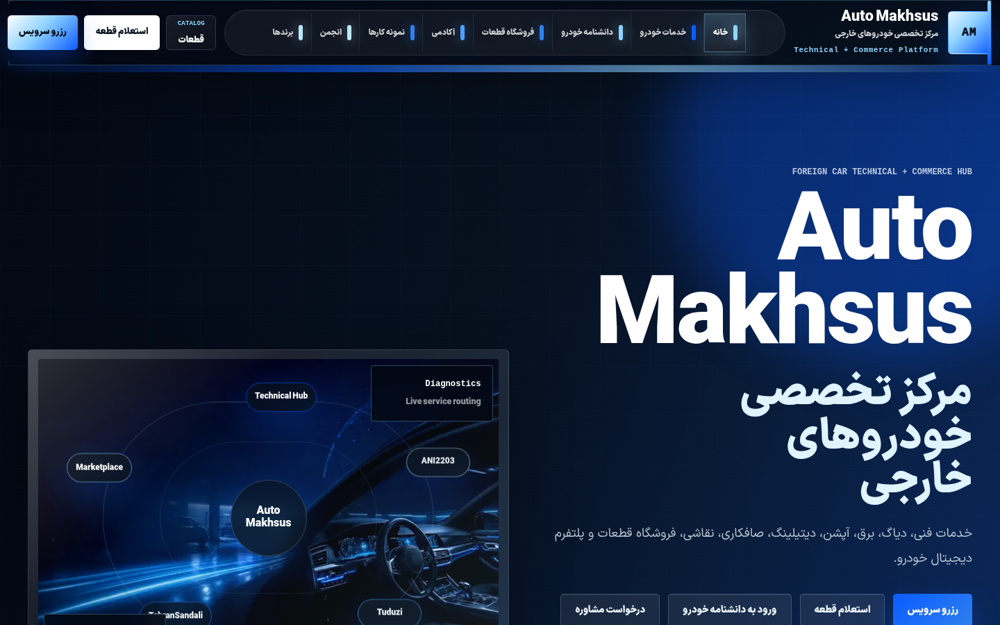

### 2. Header Desktop

- Page path: `/fa`
- Screenshot path: `docs/visual-proof-20260615/02-header-desktop.png`
- Before/after summary: Before, navigation was functional but not strong enough for a premium automotive platform. After, the header has a bold RTL nav bar, large Auto Makhsus wordmark, catalog access, and visible service/parts CTAs.
- What changed: sticky dark/glass header styling, stronger wordmark zone, grouped nav items, CTA hierarchy, catalog pill, blue active states.
- Scores: Visual Impact 8, Luxury Feeling 8, Automotive Feeling 8, Store Quality 8, Mobile Experience 7.

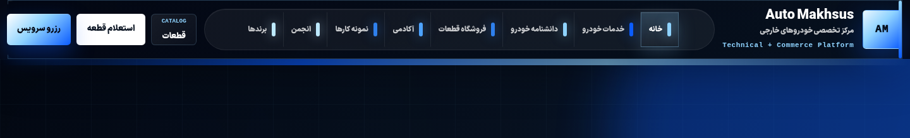

### 3. Header Mobile

- Page path: `/fa`
- Screenshot path: `docs/visual-proof-20260615/03-header-mobile.png`
- Before/after summary: Before, mobile navigation was closer to a standard drawer. After, it has large action buttons, clear service/parts/contact paths, and grouped accordion sections.
- What changed: mobile drawer, large tappable CTA buttons, service group expansion, dark automotive surface, stronger RTL spacing.
- Scores: Visual Impact 8, Luxury Feeling 7, Automotive Feeling 8, Store Quality 8, Mobile Experience 8.

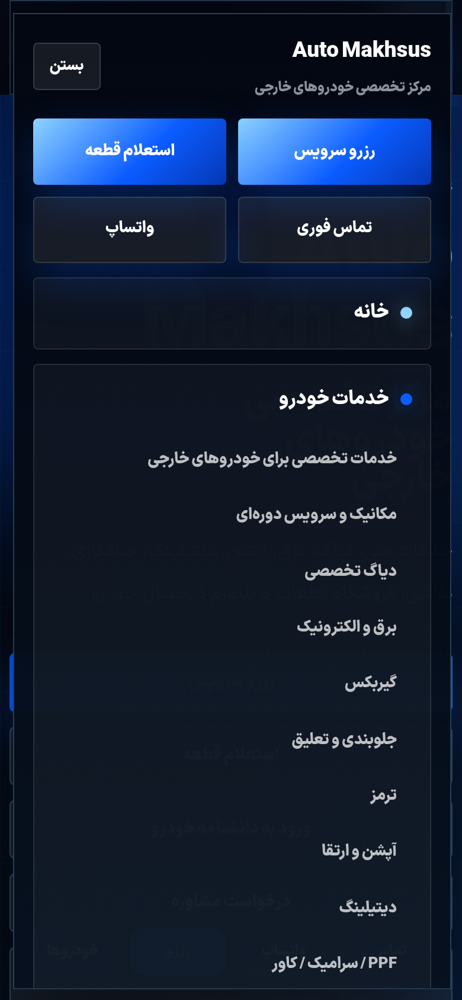

### 4. Mega Menu

- Page path: `/fa`
- Screenshot path: `docs/visual-proof-20260615/04-mega-menu.png`
- Before/after summary: Before, top navigation did not prove a premium grouped mega-menu experience. After, the services mega menu shows a large feature panel plus automotive service cards.
- What changed: desktop mega menu, numbered technical service cards, right-side feature panel, CRM-backed service messaging, service booking and inspection CTAs.
- Scores: Visual Impact 9, Luxury Feeling 8, Automotive Feeling 9, Store Quality 7, Mobile Experience 7.

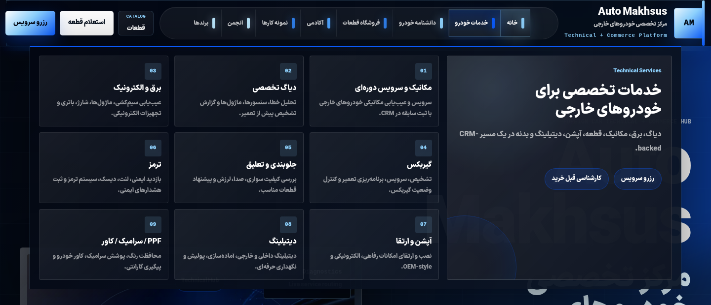

### 5. Cars Gallery

- Page path: `/fa/cars`
- Screenshot path: `docs/visual-proof-20260615/05-cars-gallery.png`
- Before/after summary: Before, the vehicle knowledge base risked feeling like a directory. After, it reads as a premium automotive gallery with a strong hero, filters, featured brands, and model/generation counts.
- What changed: gallery hero, search/filter controls, dark visual language, brand cards, region/category filters, CTA-driven discovery.
- Scores: Visual Impact 9, Luxury Feeling 8, Automotive Feeling 9, Store Quality 7, Mobile Experience 8.

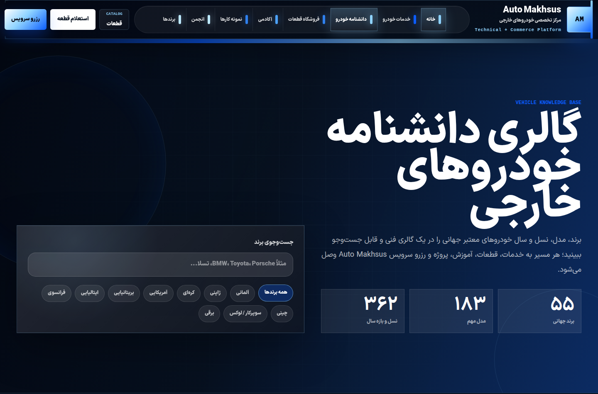

### 6. BMW Page

- Page path: `/fa/cars/bmw`
- Screenshot path: `docs/visual-proof-20260615/06-bmw-page.png`
- Before/after summary: Before, brand pages were more informational. After, the BMW page uses a premium brand hero and structured model layout.
- What changed: brand mark presentation, origin/category metrics, model grid, related service/store/content CTAs, richer visual structure.
- Scores: Visual Impact 8, Luxury Feeling 8, Automotive Feeling 9, Store Quality 7, Mobile Experience 8.

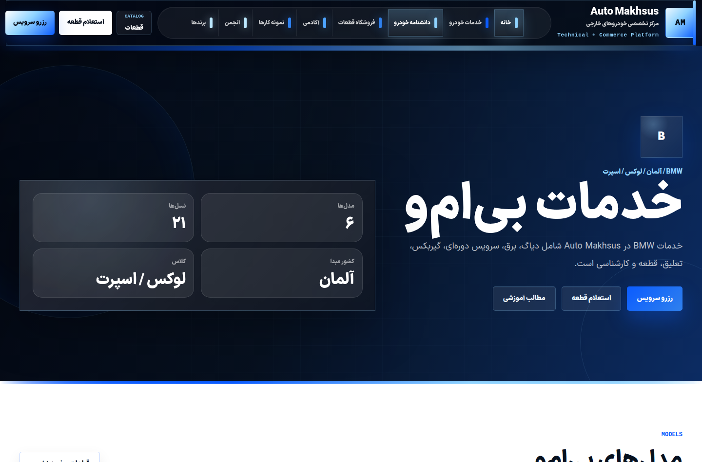

### 7. BMW X5 Page

- Page path: `/fa/cars/bmw/x5`
- Screenshot path: `docs/visual-proof-20260615/07-bmw-x5-page.png`
- Before/after summary: Before, model pages were mostly content hubs. After, the BMW X5 page has a stronger model hero, generation timeline, issue/service sections, and commercial CTAs.
- What changed: model hero, generation cards, diagnostics/service/parts framing, related content paths, service and parts inquiry CTAs.
- Scores: Visual Impact 8, Luxury Feeling 8, Automotive Feeling 9, Store Quality 7, Mobile Experience 8.

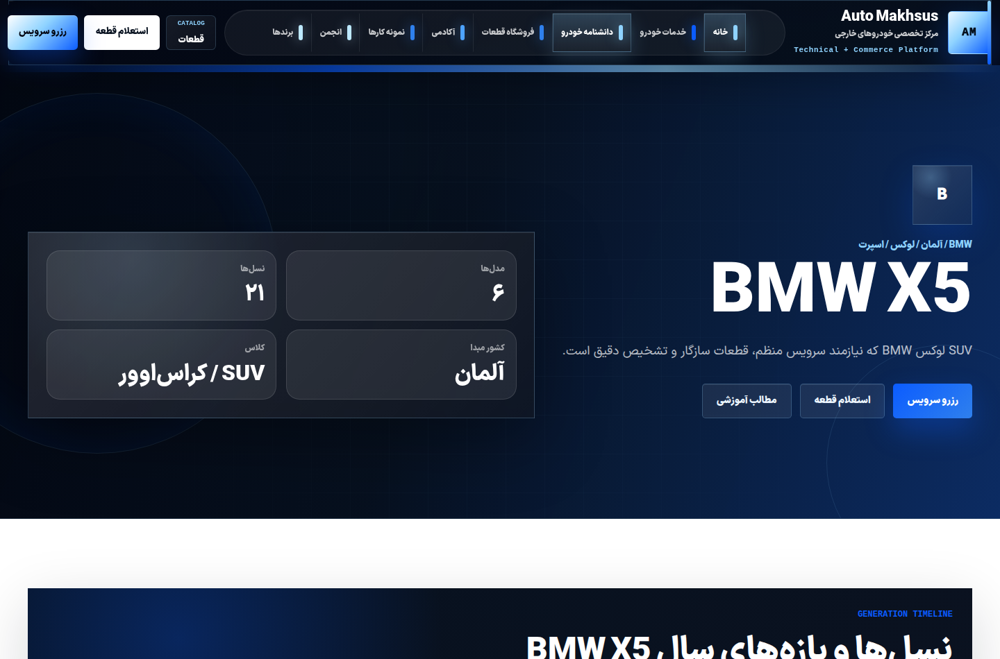

### 8. Store Homepage

- Page path: `/fa/store`
- Screenshot path: `docs/visual-proof-20260615/08-store-homepage.png`
- Before/after summary: Before, the store looked more like a preview section. After, it has a full shop hero, product/category framing, and catalog-style panels.
- What changed: shop hero, parts-rack visual, category grid, product listing area, filtering concept, price inquiry and buy + install CTAs.
- Scores: Visual Impact 9, Luxury Feeling 8, Automotive Feeling 9, Store Quality 9, Mobile Experience 8.

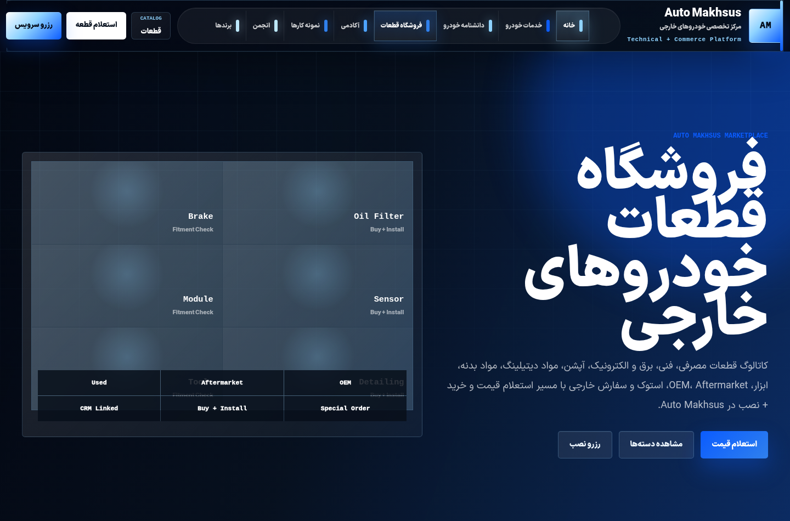

### 9. Store Category Page

- Page path: `/fa/store/categories/consumables`
- Screenshot path: `docs/visual-proof-20260615/09-store-category-page.png`
- Before/after summary: Before, category depth was not visually evident. After, category pages present a category hero, buy + install explanation, product grid, and filter sidebar.
- What changed: category detail layout, product grid by category, marketplace intent CTA, fitment/service explanation, stronger shop-like rhythm.
- Scores: Visual Impact 8, Luxury Feeling 8, Automotive Feeling 8, Store Quality 9, Mobile Experience 8.

### 10. Product Page

- Page path: `/fa/store/products/oem-oil-filter-bmw-benz`
- Screenshot path: `docs/visual-proof-20260615/10-product-page.png`
- Before/after summary: Before, product detail pages needed stronger shop identity. After, the product page has a dedicated product hero, spec-style visual, compatibility, install option, and lead CTAs.
- What changed: product hero, product packshot placeholder, commercial CTA area, technical description, compatibility blocks, install option panel.
- Scores: Visual Impact 8, Luxury Feeling 8, Automotive Feeling 9, Store Quality 9, Mobile Experience 8.

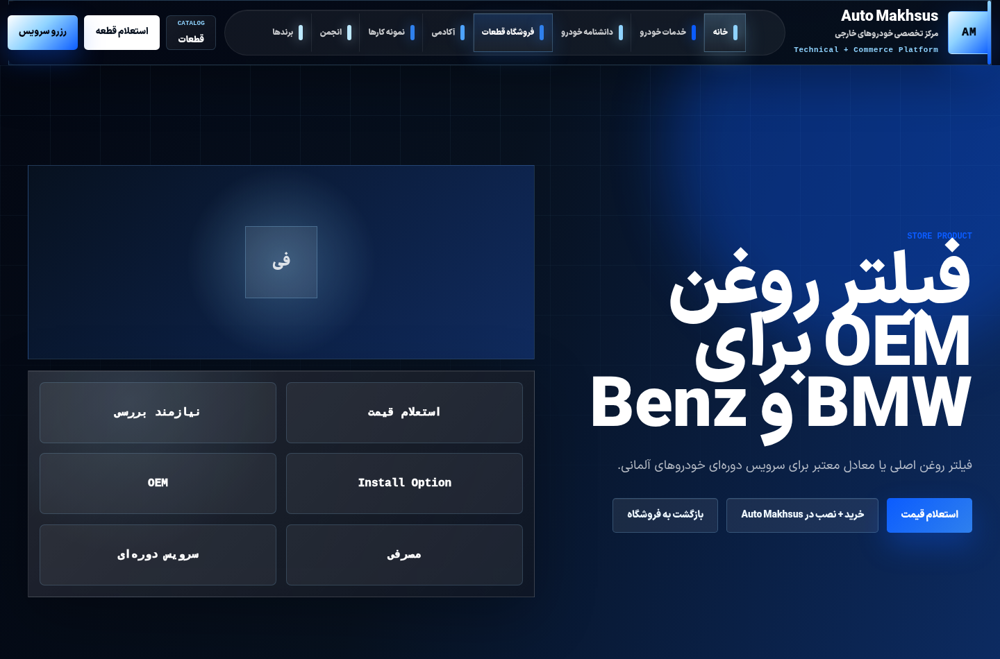

### 11. Academy

- Page path: `/fa/academy`
- Screenshot path: `docs/visual-proof-20260615/11-academy.png`
- Before/after summary: Before, content routes could feel like generic card lists. After, Academy uses the same automotive-tech visual system with strong hero rhythm and magazine-style content cards.
- What changed: stronger page hero, consistent cards, high-contrast section surfaces, lead paths into service and vehicle knowledge.
- Scores: Visual Impact 8, Luxury Feeling 7, Automotive Feeling 8, Store Quality 6, Mobile Experience 8.

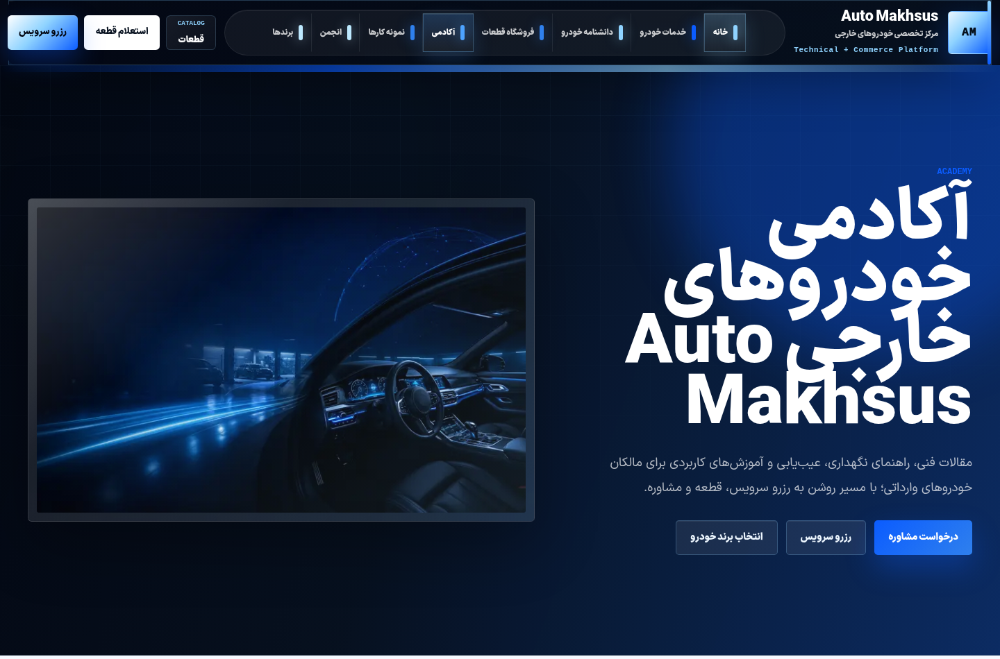

### 12. Projects

- Page path: `/fa/projects`
- Screenshot path: `docs/visual-proof-20260615/12-projects.png`
- Before/after summary: Before, project pages were closer to content listings. After, projects read as automotive showcase content with stronger cards and CTA hierarchy.
- What changed: hero treatment, project cards, service/vehicle metadata, stronger dark/light contrast, project-to-lead conversion paths.
- Scores: Visual Impact 8, Luxury Feeling 8, Automotive Feeling 9, Store Quality 6, Mobile Experience 8.

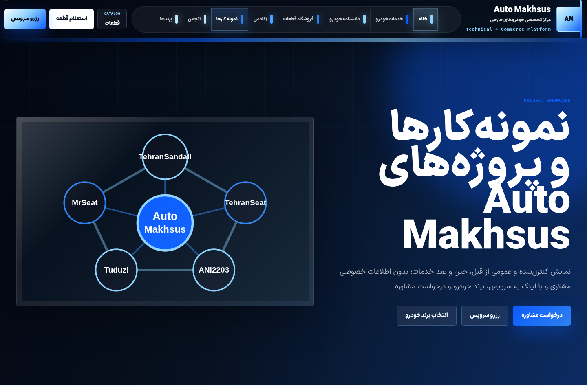

### 13. Feed

- Page path: `/fa/feed`
- Screenshot path: `docs/visual-proof-20260615/13-feed.png`
- Before/after summary: Before, the daily feed risked looking like a basic list. After, it has a more premium social/content stream style aligned with the rebuilt visual language.
- What changed: page hero, feed cards, automotive metadata, CTA-driven stream layout, consistent dark/navy/blue UI.
- Scores: Visual Impact 8, Luxury Feeling 7, Automotive Feeling 8, Store Quality 6, Mobile Experience 8.

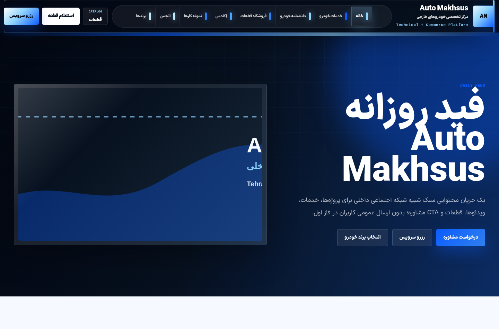

### 14. Footer

- Page path: `/fa`
- Screenshot path: `docs/visual-proof-20260615/14-footer.png`
- Before/after summary: Before, the footer was less prominent and less conversion-oriented. After, it has a strong support-center block, service/store/knowledge/brand columns, contact links, and final CTAs.
- What changed: dark premium footer, support CTA strip, structured columns, canonical brand hierarchy, contact/social actions, stronger service and store discovery.
- Scores: Visual Impact 8, Luxury Feeling 8, Automotive Feeling 8, Store Quality 8, Mobile Experience 7.

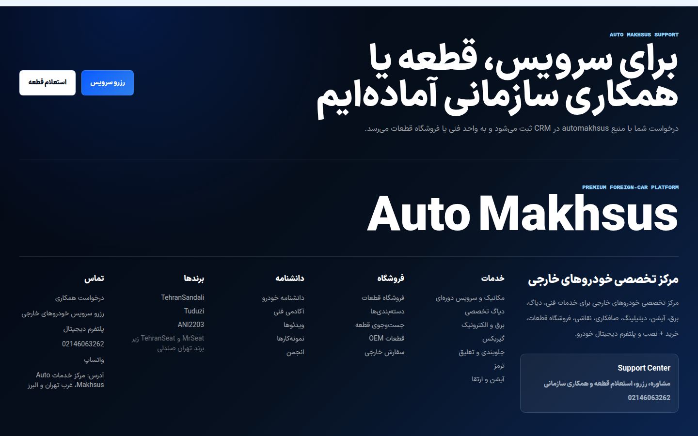

## Proof Summary

The screenshots show that the rebuild is visible across the actual rendered site:

- Header and menu changed from basic navigation to a bold automotive mega-menu system.
- Homepage changed from a generic platform feel to a large automotive-tech landing page.
- Store changed from preview/catalog hints to full catalog routes with categories, products, search, filtering UI, and product details.
- Vehicle knowledge pages changed into a gallery-style experience with brand/model/generation structure.
- Content pages share the same rebuilt visual language instead of isolated generic cards.
- Footer now functions as a premium support and navigation endpoint.

## Remaining Visual Recommendations

- Add approved internal or licensed automotive photography to raise luxury feeling from 8/10 toward 9+/10.
- Continue reducing mobile drawer density for faster thumb navigation.
- Add CMS-managed product/category imagery once marketplace operations mature.
- Add real project media to Academy, Projects, Videos, and Feed to reduce reliance on graphic placeholders.
